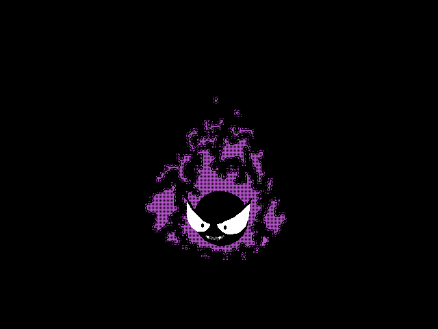

<!-- Header com banner animado -->

  

<!-- Seção Sobre mim -->
## 💫 Sobre mim
Sou uma pessoa curiosa e criativa, apaixonada por tecnologia e por resolver problemas com código.  
Atualmente estudando para me tornar **Desenvolvedora Fullstack**, com foco em **JavaScript**, **React**, **Node.js** e **DevOps**.  

📍 Curitiba - PR  
☕ Viciada em café e em aprender algo novo todo dia.  
💜 Sempre evoluindo — um bug por vez.

---

<!-- Seção de estudos -->
## 📚 Estudando no momento

  

Atualmente estou me aprofundando em:
-  **Desenvolvimento Fullstack (HTML, CSS, JS, React, Node.js)**
-  **DevOps (Docker, Containers, CI/CD)**
-  **Lógica de Programação e Estruturas de Dados**

---

<!-- Tecnologias -->
## 💻 Tecnologias e Ferramentas

  

---

<!-- Contato -->
## 📫 Como me encontrar

  
  

---

<!-- Rodapé com Gastly e loading -->

   
  
   
  🌀 <i>Carregando aprendizado...</i> 💜

